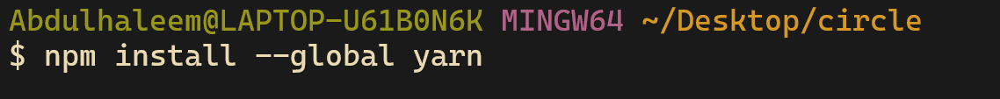

Hello, In this Article I am going to give you a clear guide on 

- how to setup circle payment API to
- collect payment from your users via cards(Debit and Credit)
- and verify it using postman

So, Let's dive right in


[this stripe video Gives a quick overview of how 3D Secure authentication works](https://www.youtube.com/watch?v=2kc-FjU2-mY) - it is used to safeguard users from fraud

## In this article i am going to use Sample web application issued by circle to replicate real payment

### Setting up the web App
- Go to your command line(GIT BASH preferrably) and input

```console
git -v
```


If you don't have git installed, It will return an Error,
checkout this [article](https://github.com/git-guides/install-git) on how to install it.

Run the command the above again to confirm if it is installed.

We need another program called **Node** which will help us run the web app.

Check if it is on your system by running the command below

```shell
node -v
```


If an error is returned you probably don't have it installed. head over to Node official [website](https://nodejs.org/en/) to set it up

We need one more program called **Yarn**, the reason we need it because the web app was set up to use it.

## -To Install `yarn` use the command below

```console
npm install --global yarn
```



## Cloning the Directory of the web app
We need to clone the repo of the web app
<br/>
In your Bash terminal input the command below


```sh
git clone https://github.com/circlefin/payments-sample-app.git
```

once you've cloned, you can go into the folder with the **`cd`** (change directory) command

```sh
cd payments-sample-app
```


<br>

Next we need to create  a base URL in a `.env` file


```sh
echo BASE_URL=https://api-sandbox.circle.com > .env
```

You will notice that there is no space in the command above, it's because if we put a space without a quote it will return an error.

After the file has been created, You can install the necessary libraries with the following command

```sh
yarn install
```

Once you've installed the libraries with command above, Start the Web Application with the command below

```sh
yarn dev
```

if you receive an error when you run the command above check out this [link](https://stackoverflow.com/questions/69692842/error-message-error0308010cdigital-envelope-routinesunsupported) to fix it or just do a simple Google search of the error


if it runs successfully you should see an output like this


you can access the webpage using the link in the output or simply just

paste the following into your browser

```http://localhost:3011/```

## Inserting Web API key

To get you web api key, create an account at https://api-sandbox.circle.com

- Then open the localhost link in the previous section in your browser

- In the Localhost page you should see a icon on top right of the page, Click on it and insert your API key in the field there

- Then return to the main page, then click on the "Charge Flow" button

- Then you will see a section that request payment card info, Don't worry cause we won't be using our payment card. Just click on the "PREFILL FORM" on the top of the page.
   In the amount section just put $9.99 

- Then click on make payment.

Note: if you are not seeing the "PREFILL FORM" , then make sure the link you are using has Localhost in it, that should resolve the issue

Then Implement the step in step 4 of this [link](https://app.stackup.dev/quest_page/payments-api)

WELL DONE, you've verified the payment


